# FinEdu - Educazione e Analisi Finanziaria per Tutti

## Setup locale

Il progetto include gia' il framework CodeIgniter nella cartella `system/`, quindi per questa consegna non e' necessario usare Composer per avviare l'applicazione. Prima di eseguirla, creare il file locale di configurazione partendo dal modello:

```powershell
Copy-Item env.example .env
```

Il file `.env` contiene la configurazione locale dell'applicazione, in particolare `app.baseURL` e i dati di connessione MySQL (`database.default.*`). Non va pubblicato su GitHub: nel repository rimane solo `env.example`, mentre `.env` e `env` sono ignorati.

Per avviare il progetto in locale:

```powershell
php spark serve
```

### Database

I file SQL sono nella cartella `database/`:

- `database/finedu-schema.sql`: crea il database `finedu` e tutte le tabelle.
- `database/finedu-seed-example.sql`: contiene dati di esempio utili per provare l'applicazione. Se e' presente un file dati completo, ad esempio `database/finedu-data.sql`, va importato dopo lo schema.

Esempio da terminale:

```powershell
mysql -u root -p < database/finedu-schema.sql
mysql -u root -p finedu < database/finedu-seed-example.sql
```

Aggiornare poi `.env` con username, password, host e porta corretti del proprio MySQL.

### Scheduler prezzi

L'aggiornamento delle quotazioni viene eseguito dal comando CodeIgniter:

```powershell
php spark prices:update
```

In locale puo' essere configurato con Utilita' di pianificazione di Windows: creare un'attivita' ripetuta ogni 15 minuti, impostare come programma il percorso di `php.exe`, come argomento `spark prices:update`, e come cartella di avvio la root del progetto `finedu`. Il comando usa i dati del file `.env`, quindi lo scheduler deve partire dalla cartella corretta.

> **Nota:** Allegati in seguito data la difficoltà della visualizzazione, inoltre non è presente la chiave esterna, presente in quasi ogni entità, riferita all'utente che ha effettuato l'ultima modifica, vista la scarsa leggibilità che causerebbe.

## Indice

- [1. Introduzione](#1-introduzione)
  - [1.1 Soluzione Proposta e Utenti Target](#11-soluzione-proposta-e-utenti-target)
  - [1.2 Differenze e Similitudini con altre Applicazioni](#12-differenze-e-similitudini-con-altre-applicazioni)
  - [1.3 Tecnologie Utilizzate](#13-tecnologie-utilizzate)
  - [1.4 Scelte Grafiche](#14-scelte-grafiche)
- [2. Database e Model](#2-database-e-model)
  - [2.1 Model](#21-model)
  - [2.2 Descrizione Database](#22-descrizione-database)
  - [2.3 Diagramma ER Database*](#23-diagramma-er-database)
  - [2.4 Schema Logico Database*](#24-schema-logico-database)
- [3. Back-End](#3-back-end)
  - [3.1 Descrizione](#31-descrizione)
    - [Autenticazione](#autenticazione)
    - [Gestione Utenti](#gestione-utenti)
    - [Esportazione in CSV](#esportazione-in-csv)
    - [Endpoint Prezzi](#endpoint-prezzi)
    - [Recupero dati dal bilancio](#recupero-dati-dal-bilancio)
    - [Inizio Educazione Finanziaria](#inizio-educazione-finanziaria)
    - [Visualizzazione Moduli](#visualizzazione-moduli)
    - [Lezioni](#lezioni)
    - [Gestione Educazione Finanziaria](#gestione-educazione-finanziaria)
    - [Portafogli e Ordini](#portafogli-e-ordini)
    - [Gestione Portafogli e Ordini](#gestione-portafogli-e-ordini)
    - [Grafico](#grafico)
    - [AJAX pop-up](#ajax-pop-up)
  - [3.2 Particolarità](#32-particolarita)
- [4. Front-End](#4-front-end)
  - [4.1 Homepage](#41-homepage)
  - [4.2 Autenticazione](#42-autenticazione)
    - [Login Modal](#login-modal)
    - [Validazione Autenticazione](#validazione-autenticazione)
    - [Registrazione Modal](#registrazione-modal)
    - [Profilo Utente](#profilo-utente)
    - [Modal Eliminazione Utente](#modal-eliminazione-utente)
    - [Real-Time Password Reset Validazione](#real-time-password-reset-validazione)
    - [Warning Pop-Up](#warning-pop-up)
  - [4.3 Admin](#43-admin)
    - [Navbar Amministrazione](#navbar-amministrazione)
    - [Dashboard Administration](#dashboard-administration)
  - [4.4 Gestione Utenti](#44-gestione-utenti)
    - [Modal Azioni Utente](#modal-azioni-utente)
  - [4.5 Portafogli](#45-portafogli)
    - [Ordini](#ordini)
    - [Modal Aggiungi Portafogli](#modal-aggiungi-portafogli)
    - [Gestione Portafogli](#gestione-portafogli)
    - [Gestione Ordini](#gestione-ordini)
  - [4.6 Società](#46-societa)
    - [Analisi di Mercato](#analisi-di-mercato)
    - [Notizia](#notizia)
    - [Negozia](#negozia)
    - [Gestione News](#gestione-news)
    - [Form Pubblicazione Notizia](#form-pubblicazione-notizia)
    - [Gestione Società](#gestione-societa)
    - [Aggiungi Società](#aggiungi-societa)
    - [Modifica e/o Visualizzazione](#modifica-eo-visualizzazione)
      - [1. Dati Base](#1-dati-base)
      - [2. Quotazioni](#2-quotazioni)
      - [3. Bilanci (Dati Finanziari)](#3-bilanci-dati-finanziari)
      - [4. Consiglio di Amministrazione](#4-consiglio-di-amministrazione)
    - [Gestione Borse Valori](#gestione-borse-valori)
  - [4.7 Educazione Finanziaria](#47-educazione-finanziaria)
    - [Moduli e Progressi](#moduli-e-progressi)
    - [Modulo, Quiz](#modulo-quiz)
    - [Modulo, Spiegazione](#modulo-spiegazione)
    - [Gestione Moduli e Lezioni.](#gestione-moduli-e-lezioni)
    - [Visualizza Spiegazione](#visualizza-spiegazione)
    - [Modifica Spiegazione](#modifica-spiegazione)
    - [Quiz Editor](#quiz-editor)
    - [Aggiungi e Modifica Quiz](#aggiungi-e-modifica-quiz)
  - [4.8 Tabelle Dizionario](#48-tabelle-dizionario)

## 1. Introduzione

### 1.1 Soluzione Proposta e Utenti Target

FinEdu è un'applicazione web che si propone come soluzione al problema della scarsa alfabetizzazione finanziaria e, più in generale, offre una serie di servizi necessari ad un aspirante, ma anche esperto, investitore retail (non professionista).

In Italia, infatti, secondo un [report di Banca d'Italia](https://www.bancaditalia.it/pubblicazioni/indagini-alfabetizzazione/2023-indag-alfabetizzazione-giovani/statistiche_AFG_09012024.pdf), il 55% dei giovani intervistati sa che il conto corrente NON protegge dall'inflazione, il 30% è in grado di definire il concetto di interesse composto e solo il 14% ha sottoscritto azioni o obbligazioni.

I dati sopra citati evidenziano la necessità di un applicazione di questo tipo al fine di educare i giovani nell'amministrazione delle proprie finanze ed aiutare studenti universitari con eventuali partnership future.

### 1.2 Differenze e Similitudini con altre Applicazioni

Sono state identificate due principali applicazioni con simili caratteristiche:

- **[Bloomberg](https://www.bloomberg.com/):** un'agenzia di stampa usata da professionisti che fornisce dati finanziari e di bilancio delle società quotate ([MarketScreener](https://it.marketscreener.com/)è una versione gratuita e semplificata).
- **[Borsa Italiana](https://www.borsaitaliana.it/):** l'applicazione della Borsa di Milano che contiene dati e notizie riguardanti il mondo finanziario italiano ed europeo, talvolta con accordi con enti ed istituzioni quali CONSOB e Bankitalia. Mette a disposizione informazioni di base su tutti gli strumenti quotati a Piazza Affari, ma anche una serie di corsi di formazione.
- **[Duolingo](https://it.duolingo.com/):** una piattaforma di apprendimento linguistico che tramite un percorso guidato progressivo aiuta l'utente a raggiungere un obiettivo prefissato.

Data la difficoltà di eguagliare la quantità di strumenti finanziari messi a disposizione dalle prime due piattaforme, Finedu offre la visione dei dati finanziari ed economici delle principali imprese italiane (Blue Chip e Mid Cap). Integra, inoltre, una sezione legata all'apprendimento (“Educazione Finanziaria”), in cui l'utente può svolgere un percorso, simile alla soluzione offerta da DuoLingo, diviso in moduli. Ogni modulo contiene un macro-argomento (es. Gestione del Rischio, Diversificazione) che, oltre a spiegazioni, contiene domande a risposta multipla e simulazioni. Il livello iniziale dell'utente viene valutato tramite apposito questionario (in stile MiFID II).

### 1.3 Tecnologie Utilizzate

Nel Backend è stato utilizzato un framework di PHP, CodeIgniter 4.6 sfruttando, così, i metodi preesistenti, ad esempio: il Query Builder per la costruzione di query complesse, il metodo paginate() per suddividere i record in pagine, redirect()->to("...") (che sostituisce header("Location: ...")), routing ed altre semplificazioni.

Per quanto riguarda il Front End: le view sono scritte in HTML all’interno di file PHP per facilitare la gestione dei dati ricevuti dai controller; lo stile è stato sviluppato, principalmente usando classi [Bootstrap](https://getbootstrap.com/) e [FontAwesome](https://fontawesome.com/); per rendere le pagine più dinamiche sono state utilizzate chiamate asincrone (AJAX) che ricevono dal server JSON e lo elaborano costruendo pagine HTML; infine sono state usate le DataTables di [jQuery](https://jquery.com/) per la creazione delle tabelle ed altre librerie come [Chart.js](https://www.chartjs.org/) per l'elaborazione di dati.

Il codice Javascript è stato adattato alla sintassi ES6, la costruzione delle pagine HTML avviene manipolando la struttura ad albero del DOM.

Utilizza, inoltre, strutture complesse come il DocumentFragment per la creazione di nodi DOM non renderizzati, riducendo la lentezza causata da un inserimento di una grande mole di dati.

Per lo sviluppo del progetto è stato utilizzato il design pattern MVC (Model-View-Controller) che stabilisce una divisione precisa dei file rendendo il codice ordinato. Il Model gestisce i dati, si occupa delle varie operazioni per la visualizzazione e la manipolazione di record e tabelle su un database. Le view sono le pagine visibili all'utente con le quali può interagire. Mostrano i dati forniti dai controller, li inviano al server e non contengono logica. Il Controller funge da intermediario tra Model e View. Riceve gli input dell'utente, coordina la logica applicativa e interroga il Model per aggiornare la View con i dati richiesti.

Il DBMS adottato è MySQL.

### 1.4 Scelte Grafiche

Il design è stato sviluppato garantendo chiarezza nelle varie sezioni. I componenti utilizzano classi Bootstrap (come ”.col”) che rendono le pagine responsive, utilizzabili quindi da vari dispositivi. La barra di navigazione è una navbar sticky-top (fissa in alto) con menù a tendina (.dropdown) per le delle sottocategorie. Per quanto riguarda i colori, vengono utilizzati: il blu (primary Bootstrap) come colore principale e il bianco come secondario. Questa combinazione aumenta la leggibilità. Il footer, invece, è composto da tre colonne: la prima contiene  la mission, la seconda i link presenti nella navbar e nell'ultima i contatti.

Dal punto di vista funzionale, l'integrazione di finestre pop-up (modal) permettono di gestire l'input dell'utente senza cambiare pagina.

## 2. Database e Model

### 2.1 Model

Il Model di questa applicazione contiene file per ogni tabella presente. Le funzionalità principali, oltre a CRUD base, sono:

- **Gestione dei Prezzi Storici:** Si occupa di registrare i prezzi giornalieri (Prices) ottenuti dall'endpoint esterno (Yahoo Finance), associandoli correttamente al Listing (Ticker e MIC) per mantenere lo storico necessario alla costruzione dei grafici.
- **Gestione Logica dei Portafogli e Ordini:** Gestisce le transazioni (Orders) e la conseguente manipolazione dei dati nei Portfolios, come:
  - Aggiornare la liquidità e il capitale investito di un portafoglio in base all'apertura o chiusura di un ordine.
  - Fornire i dati di base per il calcolo dinamico della variazione relativa percentuale e della plus/minusvalenza.
- **Gestione del Percorso Educativo Utente:** Registra e recupera lo storico delle attività svolte dall'utente nella sezione Educazione Finanziaria, tramite la tabella Completed_Lessons, tracciando per ogni lezione i tentativi effettuati e lo stato di completamento.
- **Mantenimento della Struttura Societaria e di Mercato:** Il Model gestisce la complessità delle relazioni molti-a-molti (ad esempio, tra Companies e Board_Members tramite Companies_Board, o tra Companies e News tramite Companies_News) e le relazioni con le tabelle dizionario (come Countries, Sectors, Exchanges e Currencies), garantendo l'integrità dei dati anagrafici e di mercato.
- **Gestione degli Utenti e dell'Autenticazione:** Sebbene il Controller gestisca l'input, il Model è incaricato delle operazioni sul database relative alla registrazione (salvataggio dell'utente e della password con hash), all'accesso (recupero dell'utente per la verifica della password) e alla gestione del profilo (modifica dati anagrafici e disattivazione/eliminazione dell'account).

### 2.2 Descrizione Database

Il database dell'applicazione implementa due sezioni principali: quella di Analisi di Mercato e quella di Educazione Finanziaria. Ogni tabella, eccetto casi particolari, ha come chiave surrogata sequenziale (a meno che non sia presente uno standard internazionale per l'identificazione), la data di creazione impostata di default alla data corrente, il timestamp (data e ora esatta) dell'ultima modifica, e l'identificativo dell'utente che l'ha effettuata.

La tabella centrale della prima parte è “Companies”, la quale rappresenta società da analizzare, ha una serie di attributi tra cui ISIN (International Securities Identification Number, regolato dalla norma [ISO 6166](https://www.iso.org/standard/78502.html)) come identificativo, il sito web, il nome e il settore in cui opera, che è una tabella dizionario “Sector” (primary key definita da codici [EA/IAF](https://services.accredia.it/accredia_tablesett.jsp?ID_LINK=1750&area=310)).

Questa include i bilanci ridotti dei vari anni, tabella “Data”, che oltre ai principali dati finanziari include l'anno, che, insieme all'identificativo della società, costituisce la chiave primaria. Ha un tipo, “Data_Type”, definito da una tabella dizionario con (“A”, Actual, cioè dati ufficiali e “C”, consensus, cioè la media delle stime degli analisti). Può esistere un solo bilancio per anno, ciò implica l’eliminazione del bilancio stimato (C) quando vengono pubblicati i dati reali (A).

Ogni società ha, poi, un Consiglio di Amministrazione (CdA) ed ogni membro è inserito nella tabella “Board_Members” che ha un codice univoco, il nome completo e il percorso di una foto. Un consigliere può appartenere al CdA di più società, per questo motivo tra “Companies” e “Board Members” c'è una relazione molti-a-molti che, insieme, generano una terza tabella “Board_Members_Companies” con il ruolo oltre ai due identificativi come primary key.

La relazione tra “Companies” e “News” è parziale: una società può esistere anche se non ci sono notizie che la riguardano. Essendo una relazione N a M, la notizia può essere riferita a più imprese. I suoi campi fondamentali comprendono il titolo, la testata (tabella Newspapers), l'autore, ecc.

Ogni società ha degli azionisti (di maggioranza), “Firm” (non identificata con VAT Number perché non necessario), che può possedere quote in più società ed una società può avere molti azionisti. Per questo motivo, la tabella “Companies_Shareholders” permette di identificare la quota che ogni azionista detiene di una determinata compagnia.

Ad ogni “Companies” vengono assegnati dei “Rating”, tabella dizionario con (“BUY”, “SELL”, “HOLD”), dagli analisti. Questi sono raccolti in “Analyst Consensus” che contiene il nome della società di rating (dentro la tabella “Firm”) e la data.

L'entità “Countries” rappresenta la sede legale di una compagnia (identificata seguendo la norma [ISO 3166](https://www.iso.org/iso-3166-country-codes.html)). La relazione è definita come parziale poiché coesiste con un'altra associazione, anch'essa parziale, verso “Exchanges”. Questo riflette il fatto che la presenza della sede legale di un'impresa in un determinato Stato non implica necessariamente l'esistenza di una borsa valori operante nel medesimo paese (ad esempio, Ferrari NV: ha sede legale in Olanda, ma l'applicazione non prevede borse valori attive in quel territorio).

“Exchanges” viene identificato con il MIC (Market Identification Code, [ISO 10383](https://www.iso.org/standard/61067.html)). In aggiunta, si possono trovare il nome completo, l'abbreviazione del nome (es. MIL) e gli orari di apertura e chiusura.

La tabella “Listings” rappresenta la quotazione della società, “Companies”. Essa può avere più quotazioni dato che le negoziazioni possono avvenire in borse differenti. In chiave ci sono: il Ticker (codice di massimo 5 lettere univoco per ogni borsa) e il codice univoco di “Exchanges”. “Currencies” è la tabella dizionario che indica la valuta in cui è scambiato lo strumento finanziario (in “Data” invece indica la valuta dei dati). Identificata secondo [ISO 4217](https://www.iso.org/iso-4217-currency-codes.html) con 3 lettere (le prime due per la nazione e la terza per la valuta)

Infine, “Prices” sono i prezzi con: data e chiave migrata di “Listings”. I prezzi non vengono registrati in tempo reale, ma a cadenza giornaliera.

Per quanto riguarda, invece, la seconda parte del database, l'obiettivo principale è quello di gestire la sezione di Educazione Finanziaria.

L'attore primario è l'utente, “Users”, identificato con una chiave surrogata e contiene dati anagrafici oltre che riguardanti il livello di conoscenza e l'esperienza dell'utente. Egli può possedere uno o più portafogli “Portfolios” che hanno una quantità di soldi investiti e in liquidità (essa verrà richiesta alla creazione del portafoglio e salvata in un'altra colonna “liquidità iniziale” in modo da riuscire a calcolare la variazione totale), inoltre, sono presenti vari “Listings”. La tabella di giunzione tra le due entità rappresenta gli ordini, “Orders”, che integrano: la quantità, il prezzo di acquisto, la data e uno stato.

“Users” ha un “Role”, ruolo, una tabella dizionario (“ADMIN, “USER”), il livello, “Level”, un'altra tabella dizionario (“Principiante”, “Intermedio”, “Avanzato”) e uno stato. L'entità "Lessons" funge da contenitore per i contenuti didattici, che si specializzano in "Questions" ed "Explanations". Queste due entità condividono gli attributi comuni ID e Title, ma si distinguono per proprietà specifiche: le "Explanations" presentano l'attributo body per il contenuto teorico, mentre le "Questions" sono caratterizzate dal legame con le "Answers". Ogni domanda prevede diverse opzioni di risposta, tra le quali è presente un attributo is_correct=1 che identifica univocamente la risposta esatta per ogni singola "Question".

In ultimo, “Users” e “Lessons” hanno, tra loro, una relazione parziale N a M, la tabella di giunzione rappresenta lo storico delle attività svolte. La lezione svolta ha un numero di tentativi, la data, e un campo per controllare se la lezione è stata completata. Tabella “Completed_Lessons”.

Alcune tabelle, quali Users, Listings e  Portfolios possono essere eliminate dagli utenti ma solo logicamente, non fisicamente, quindi la colonna active è stata implementata al fine di garantire l’integrità dei dati.

Nonostante l'ipotesi di unificare in un'unica tabella le entità Company, Firm e Board Member, si è deciso di mantenere una struttura normalizzata e distinta. Questa scelta è motivata dalla necessità di garantire l'integrità dei dati ed evitare un eccessivo utilizzo di valori nulli: unificare soggetti con attributi profondamente diversi (come l'ISIN per una società o la foto e il cognome per un consigliere) avrebbe reso la tabella poco coesa e complicato inutilmente i controlli di validità nel codice e nel DBMS. Inoltre, mantenere le tabelle separate permette di gestire le relazioni (come i bilanci in Data o le quotazioni in Listings) in modo diretto e tramite chiavi esterne specifiche. Sebbene esista una parziale ridondanza per quei rari casi in cui una Company è anche azionista di un'altra, il beneficio di avere uno schema logico chiaro e delle query (JOIN) più semplici e performanti in CodeIgniter prevale sulla compressione dei record, evitando di trasformare il database in un mix di dati eterogenei difficile da filtrare e manutenere.

All'interno del database, l'entità Company è identificata in modo univoco tramite il codice ISIN anziché la Partita IVA. Sebbene la tabella includa dati strettamente societari e non solo relativi all'azione, si è scelto di utilizzare l'identificativo finanziario per semplificare la struttura generale.

### 2.3 Diagramma ER Database*

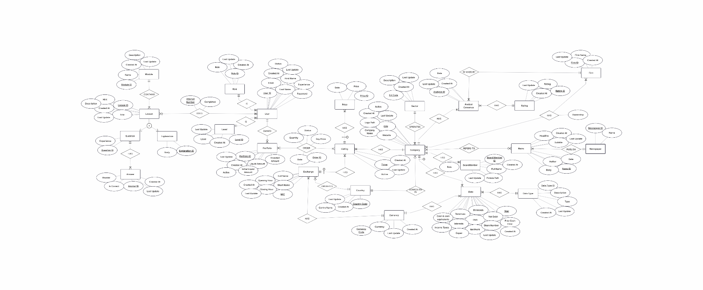

### 2.4 Schema Logico Database*

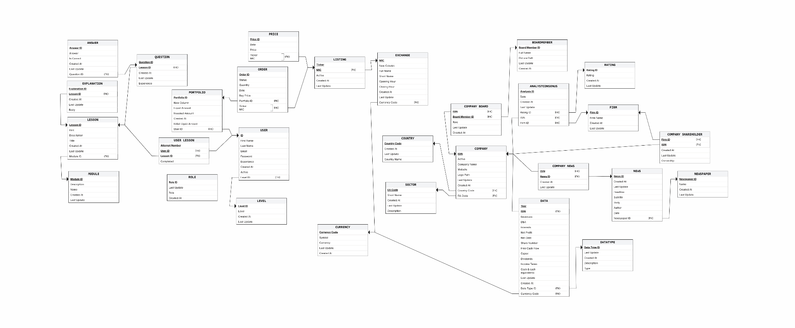

## 3. Back-End

Del Back-End fa parte anche il Model ma è stato inserito nella sezione precedente, rispettando l'architettura MVC, per dividere il come vengono elaborati i dati.

### 3.1 Descrizione

In questa applicazione web, ogni controller gestisce le funzionalità di una o più tabelle. Oltre alle operazioni CRUD (Create, Read, Update, Delete), i controller integrano funzioni specifiche per le singole entità. Essi si occupano di elaborare l'input utente ricevuto tramite le view, istanziare gli oggetti che rappresentano i record, definire i criteri di ricerca e determinare quali funzioni del model richiamare per l'elaborazione dei dati.

Le funzioni differiscono in ogni pagina. Le principali sono:

#### Autenticazione

Un qualsiasi utente può registrarsi, ovvero creare un nuovo utente effettuando l’hashing della password con l'algoritmo bcrypt fornito di default da PHP.  Egli può inoltre effettuare l'accesso e l'applicativo verificherà prima l'esistenza dell'email e, dopo, con la funzione password_verify() che confronta la password inserita con quella recuperata da DB. L'utente, accedendo alla pagina Profilo, ha la possibilità di modificare i suoi dati. anagrafici ed eliminare il suo account disattivandolo. Una volta effettuato l'accesso le variabili di sessione vengono valorizzate ed annullate in caso di logout.

#### Gestione Utenti

La sezione amministrativa della gestione utenti viene interamente gestita con AJAX, inizialmente viene caricata tutta la tabelle con dati della tabella User e di altre tabelle che hanno una chiave esterna di un utente. Poi l'URL della richiesta cambia in base ai filtri ed ogni volta che ne viene applicato uno viene effettuata la chiamata e aggiornata la tabella.

#### Esportazione in CSV

In alcune pagine è possibile esportare la tabella corrente in un file CSV. Tramite una chiamata AJAX (fetch()), il sistema costruisce l'URL includendo i filtri attualmente attivi. Il server elabora la richiesta e invia il file generato tramite uno stream di output; il browser raccoglie questi dati e fa partire automaticamente il download.

#### Endpoint Prezzi

L'applicazione interroga un endpoint esterno (Yahoo Finance). I dati ottenuti vengono salvati nella tabella Price, dove ogni record memorizza il prezzo insieme alla data di riferimento, al ticker del titolo e alla borsa di appartenenza, permettendo così di mantenere uno storico. Questa funzione viene eseguita in modo asincrono ogni 15 minuti, durante l’orario di apertura della borsa di riferimento (dal lunedì al venerdì), aggiornando i prezzi di ogni strumento.

#### Recupero dati dal bilancio

I dati di bilancio vengono acquisiti tramite file XML standard caricati dagli amministratori. In fase di importazione, il sistema estrae e salva a database solo le voci fondamentali (come Ricavi, Utile Netto, Cassa, Tasse, Interessi e D&A). Per l'elaborazione del file di bilancio, viene usata la libreria SimpleXML. La navigazione all'interno della complessa struttura del documento avviene sfruttando il linguaggio XPath. Rendendo il procedimento molto più scorrevole, dato che vengono ricavati solo i nodi interessati.

#### Inizio Educazione Finanziaria

Nel momento in cui un utente inizia il percorso di Educazione Finanziaria vengono valorizzate alcune variabili di sessione, una per tenere traccia delle lezione appena svolta o in corso. Vengono estratti casualmente 10 quiz presi dai vari moduli al fine di valutare il livello iniziale. In base all'esperienza guadagnata da questa prima prova determina il livello iniziale. I quiz dei moduli più avanzati (con id più alto) fanno ottenere più esperienza.

#### Visualizzazione Moduli

Nella view con tutti i moduli viene calcolato il progresso percentuale attuale dell'utente dividendo l'esperienza attuale per la somma dell'esperienza guadagnabile svolgendo tutti i quiz di tutti i moduli.
Viene effettuato un controllo su tutte le lezioni dei moduli svolte (recuperate da “Completed_Lessons”) e viene stabilito cosa inviare alle view (se in corso, completato, bloccato).

#### Lezioni

All'apertura di una spiegazione, il server riceve una richiesta AJAX che ne attesta la visualizzazione. Il sistema aggiorna la tabella dedicata e restituisce un JSON di risposta contenente la conferma dell'operazione e l'abilitazione della lezione successiva, mantenendo le restanti bloccate. Per i quiz, il flusso è analogo: se la risposta è corretta, si procede allo sblocco immediato; in caso di errore, la lezione successiva rimane invece inaccessibile.

#### Gestione Educazione Finanziaria

Per la gestione dei moduli e delle lezioni vengono inviati al front-end i dati sotto forma di array associativo con tutti i campi necessari. Nei quiz vengono, invece, passate le risposte ad esso collegate.

#### Portafogli e Ordini

In contemporanea alla richiesta per aggiornare i prezzi degli strumenti, anche i valori degli ordini (attivi) presenti nei portafogli cambiano dinamicamente. Inoltre viene calcolata la variazione relativa (%) dalla data di acquisto alla data corrente (o di chiusura dell'ordine). La risposta è un oggetto JSON. Al momento della chiusura dell'ordine il capitale e la plus/minusvalenza (tassata al 26%, l’aliquota di imposta sui redditi di natura finanziaria, in caso di plus) vengono trasferiti nella liquidità del portafoglio.  Viceversa quando un ordine è effettuato la liquidità utilizzata viene trasferita alla quantità di soldi investiti.La variazione del portafoglio è data dal rapporto tra il valore attuale degli ordini sommato alle disponibilità liquide e la liquidità iniziale.

#### Gestione Portafogli e Ordini

Come per gli utenti, l'amministratore può visualizzare tutti i portafogli. Per gli ordini ci sono una vasta selezione di filtri che possono essere attivati. Anche queste tabelle sono gestite con richieste asincrone

#### Grafico

Il grafico viene aggiornato insieme ai prezzi inviando al client un oggetto con i prezzi necessari e i vari timestamp.

#### AJAX pop-up

Nelle views di amministrazione i bottoni Modifica aprono modal che inviano una richiesta AJAX al server inviando l'identificativo del record selezionato. Il server recupera dai model le informazioni necessarie e ritorna un JSON rendendo dinamica la pagina.

### 3.2 Particolarità

Non vengono utilizzate API per il recupero di dati a causa del loro costo non sostenibile e della scarsa presenza di servizi che includano Borsa Italiana o Euronext gratuitamente.

Il sistema non elabora i bilanci aziendali poiché i formati disponibili nei portali ufficiali ([ESEF](https://www.consob.it/web/area-pubblica/esef)) mancano di una standardizzazione che ne permetta l'estrazione automatica. È stato inoltre escluso l'utilizzo del formato standard XBRL, in quanto non è reperibile online gratuitamente. Si è invece optato per un formato XML redatto seguendo i [principi contabili standard (IFRS) stabiliti da IASB.](https://www.ifrs.org/groups/international-accounting-standards-board/)

La decisione di non permettere agli admin di manipolare il percorso di educazione finanziaria dell'utente è data dal fatto che il sistema garantisce una corretta gestione dei vari livelli. Ciò permette di evitare che gli utenti prendano “scorciatoie”.

Gli ordini effettuati sono immutabili, non possono essere rimossi da interfaccia né dall'utente né da un amministratore, evitando così manipolazioni delle performance oltre che per chiare ragioni di trasparenza. I portafogli, una volta eliminati dall'utente, vengono solamente disattivati in modo da tenere traccia degli ordini, così come Listings e Companies.

Ogni volta che viene modificata una tabella da un admin, i controller aggiornano la colonna last_update e id_user per tenere log.

## 4. Front-End

In questa sezione sono presenti i mock-up e le descrizioni a loro relative

### 4.1 Homepage

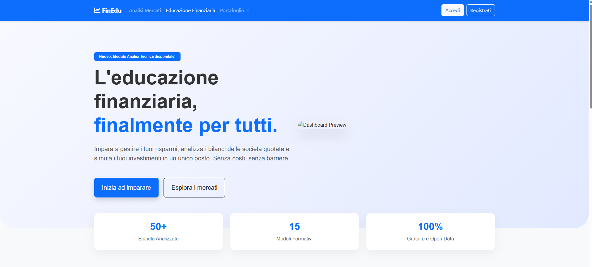

La pagina iniziale dell'applicazione presenta una panoramica delle funzionalità.

L'intestazione è una navbar con bottoni che portano alle relative sezione e, a destra, aprono due pop-up (vedi Login e Registrati). In particolare la barra di navigazione contiene Analisi Mercati, Educazione Finanziaria, Portafogli (vedi sezioni sottostanti).

### 4.2 Autenticazione

#### Login Modal

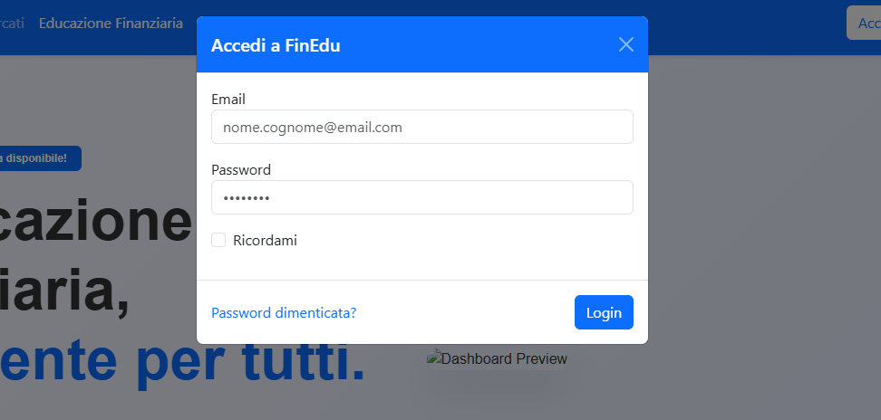

Invece del redirect ad un'altra pagina per effettuare l'accesso si è optato per un modal, gestito con Bootstrap, per rendere il tutto più dinamico.

Un modal è un'interfaccia pop-up che si sovrappone alla pagina principale.

Esso consiste in un form con due input per email e password ed un bottone di invio.

La validazione viene effettuata dopo l'invio del form e nel caso in cui non vada a buon fine i controller riportano l'utente al modal stampando l'errore che può essere di due tipi: utente non trovato e password errata.

#### Validazione Autenticazione

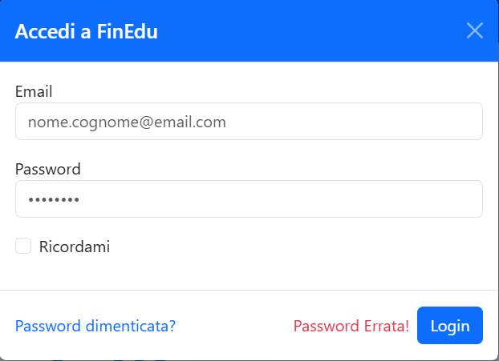

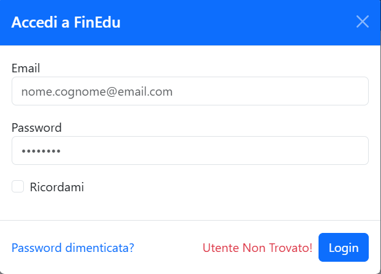

#### Registrazione Modal

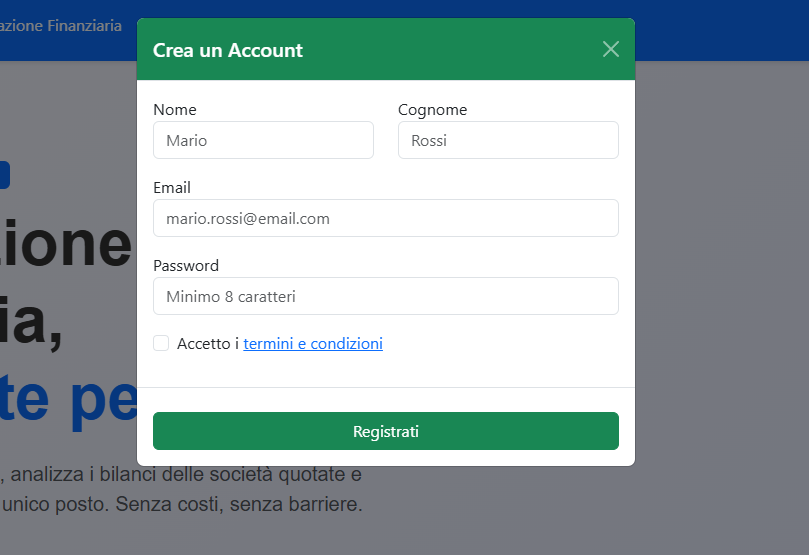

La parte di registrazione è molto simile a quella dell'accesso, tranne per i campi da inserire che sono quelli necessari al fine di registrare un nuovo utente. La gestione degli errori avviene nello stesso modo. Gli errori possono essere generici (registrazione non riuscita) oppure quando un utente è già registrato.

#### Profilo Utente

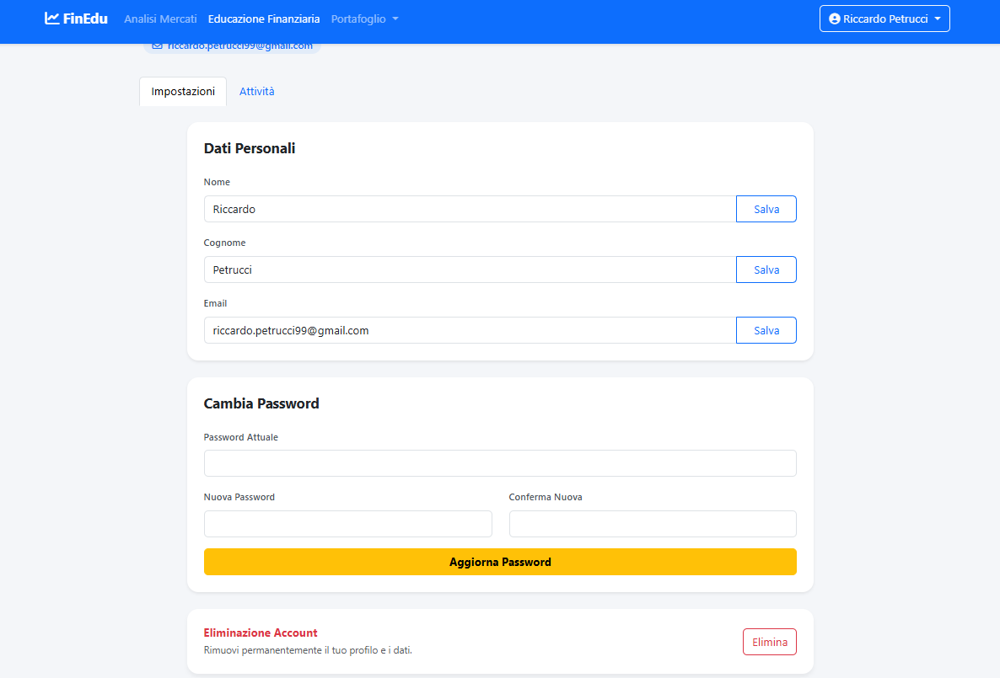

Una volta effettuato l'accesso si può usufruire di una serie di impostazioni riguardanti l'utente stesso. In particolare c'è la possibilità di modificare l'email il nome e cognome. Si può inoltre modificare la password con una procedura standard, inserendo quindi la password corretta e la nuova password 2 volte. Nel caso in cui le due password non coincidessero viene stampato l'errore in tempo reale grazie ad una funzione Javascript. L'ultima funzione disponibile è l'eliminazione che apre un modal richiedente la password come conferma per poi procedere alla cancellazione definitiva dell'utente.

#### Modal Eliminazione Utente

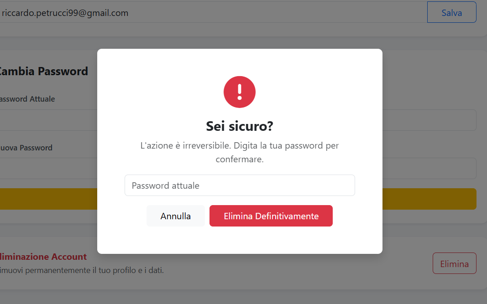

#### Real-Time Password Reset Validazione

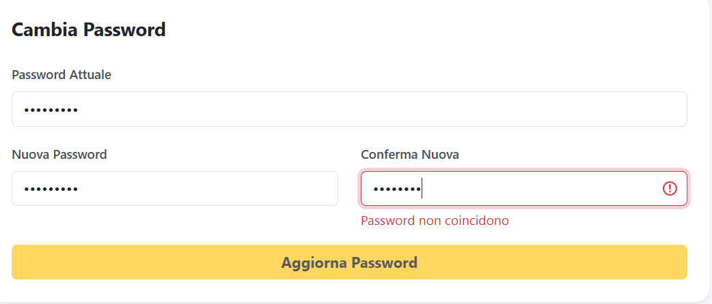

Un avviso a comparsa (pop-up) comunica l'esito dell'operazione, sia esso positivo o negativo.

#### Warning Pop-Up

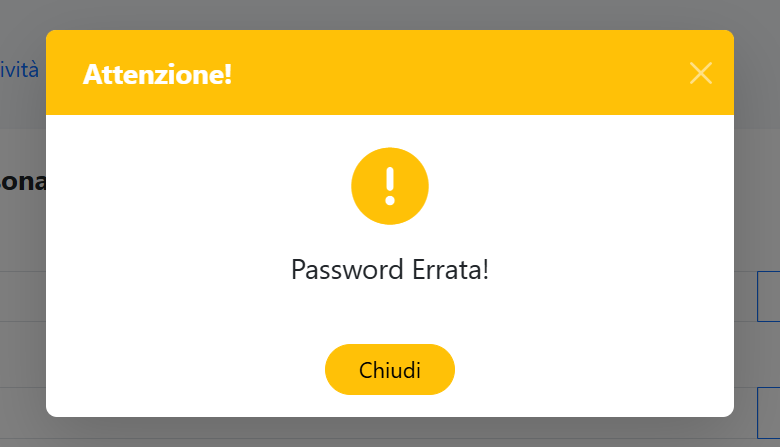

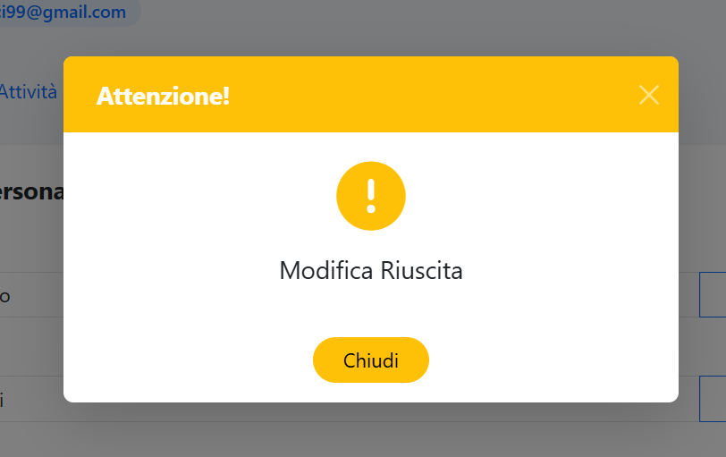

Se l'utente è loggato i due bottoni per l'autenticazione vengono sostituiti da un dropdown che offre la possibilità di effettuare il logout e di accedere alla pagina di profilo. Nel caso in cui fosse un Admin un'altra navbar viene visualizzata che dà la possibilità di gestire le varie tabelle. Essa contiene link che portano alla Gestioni di Portafogli, dei Quiz, dei Moduli, degli Utenti, delle Società, delle News, la Dashboard e il logout.

### 4.3 Admin

#### Navbar Amministrazione

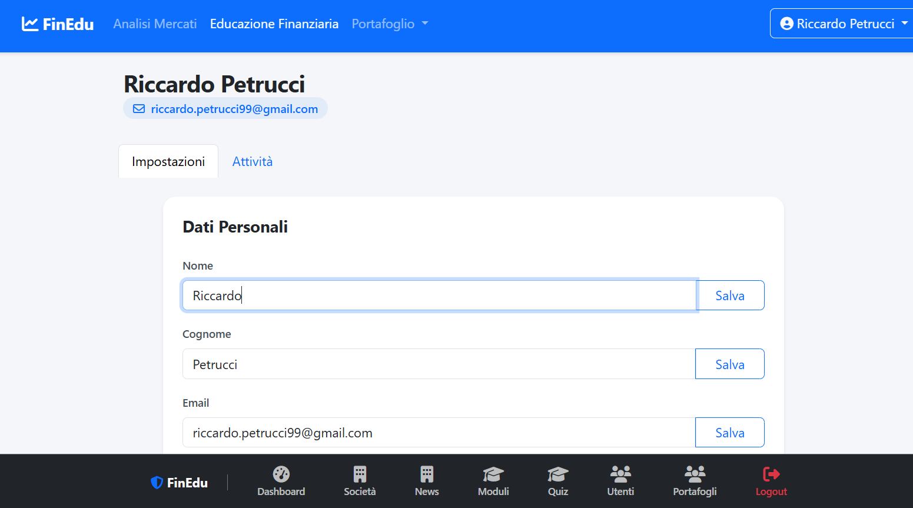

#### Dashboard Administration

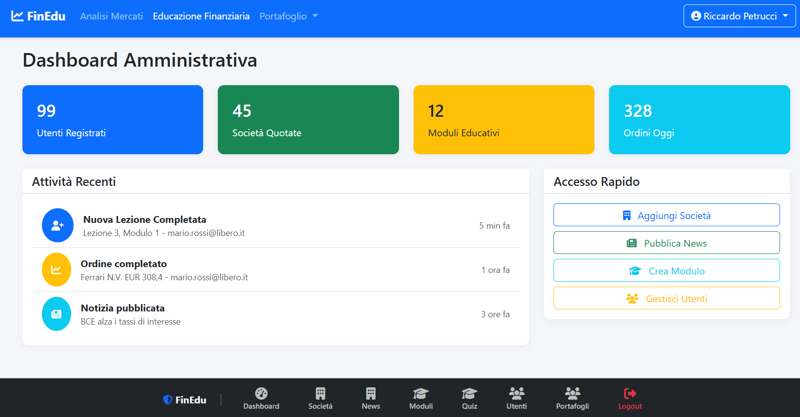

Nella Dashboard viene visualizzata una overview della situazione corrente. Sono stampati, per esempio, il numero degli utenti registrati, così come le società quotate, le ultime aggiunte svolte nel database, oltre che una serie di pulsanti per gestire le sezioni.

### 4.4 Gestione Utenti

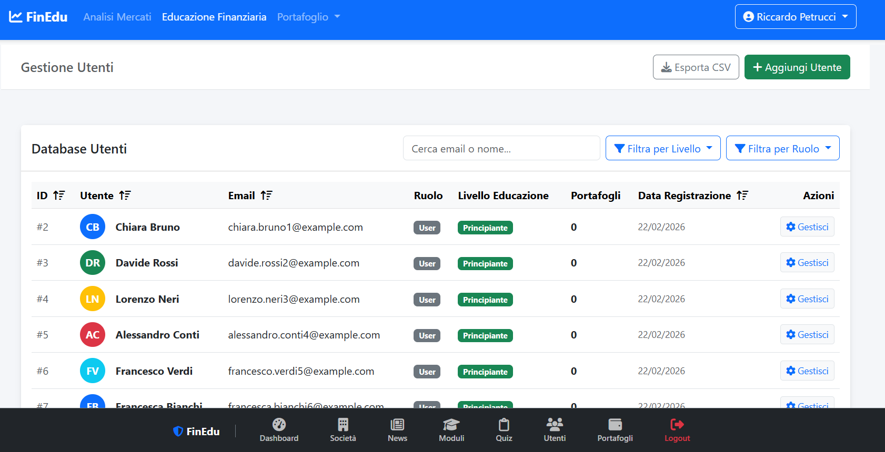

Nell'interfaccia della gestione degli utenti viene stampata una tabella con paginazioni che contiene i principali dati anagrafici e di sistema. Può essere filtrato dinamicamente tramite ricerca per email, nome e cognome oppure tramite appositi pulsanti a tendina. C'è la possibilità, poi, di ordinare la tabella secondo dei campi specificati ed identificati dall'icona. Il pulsante Gestisci è posto alla fine di ogni record e apre un pop-up che permette la modifica di alcuni campi, la visualizzazione del loro percorso nello studio finanziario, il numero di portafogli e le azioni irreversibili (disattiva, elimina).

Tutto questo è possibile grazie a delle chiamate AJAX: non appena la pagina viene caricata viene effettuata una richiesta (fetch) al server per ottenere i dati e costruire la tabella. Ogni volta che viene inserito un filtro al controller viene inviata la richiesta in modo asincrono. Il JSON di risposta viene letto ed usato per applicarli. Un esempio è l'input di ricerca, ogni volta che viene digitato qualcosa, effettua una ricerca stampando gli utenti con quei requisiti

#### Modal Azioni Utente

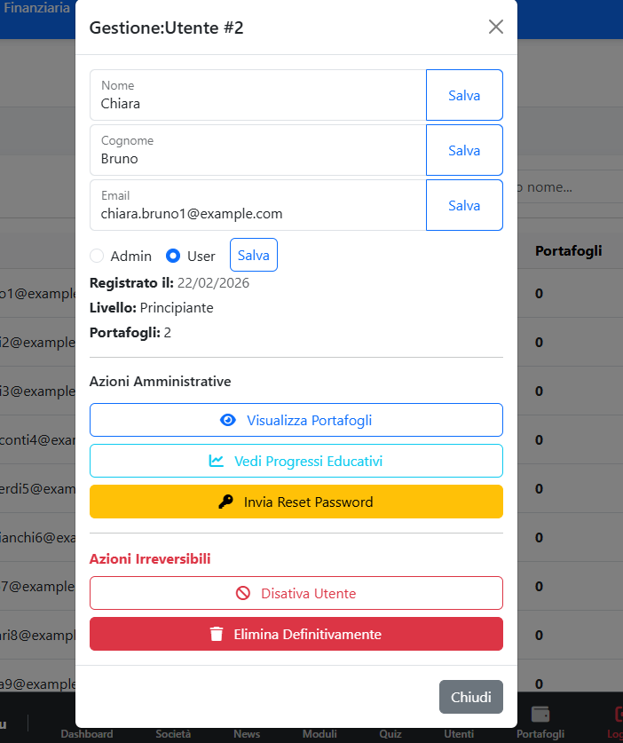

Inoltre, nella pagina, prima della tabella, due pulsanti permettono l'aggiunta di un nuovo utente e la conversione della tabella, con i filtri applicati, in un documento CSV.

### 4.5 Portafogli

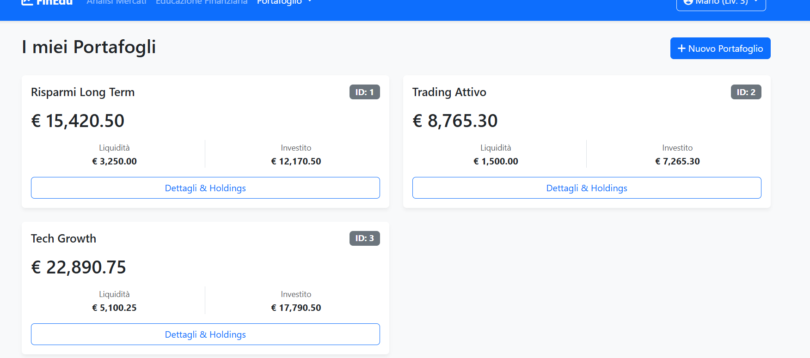

L'utente può visualizzare i dati principali dei portafogli esistenti da lui creati, può crearne di nuovi o vedere gli ordini(totali o riferiti al portafoglio selezionato).

#### Ordini

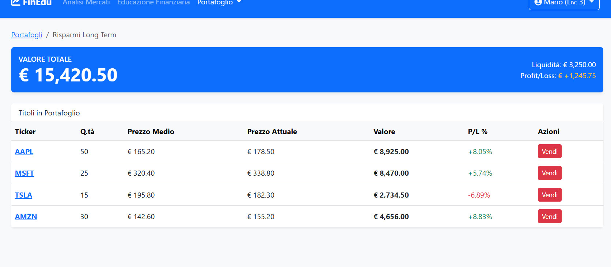

In questa pagina sono presentati campi di ogni ordine e la possibilità di chiuderlo.

#### Modal Aggiungi Portafogli

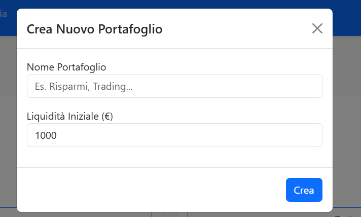

Anche questa volta la creazione di un nuovo portafoglio da parte di un utente è effettuata tramite un modal che richiede solo i due campi essenziali: liquidità iniziale e nome.

#### Gestione Portafogli

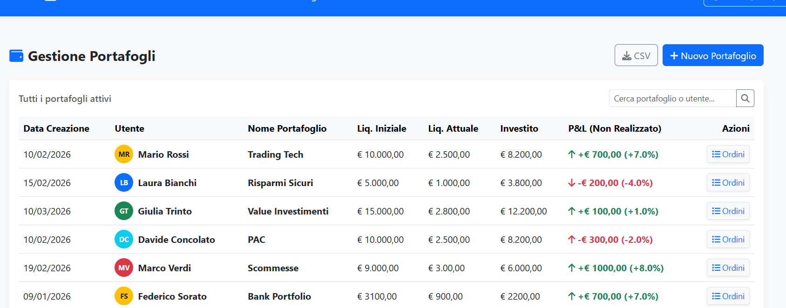

Nella pagina di gestione dei portafogli, l'amministrazione visualizza (senza manipolare) tutti i portafogli con i loro attributi e il profitto o perdita lorda che avrebbero secondo il prezzo attuale di mercato. Come per Utenti, la tabella viene stampata e impaginata. C'è, inoltre, la possibilità di aggiungere un portafoglio tramite un pop-up, come quello visto in Portafogli, e l'esportazione in CSV della tabella corrente.

Il bottone ‘Ordini’, posto alla fine di ogni record, permette all’admin di visualizzare tutti gli ordini relativi a quel portafoglio, eventualmente applicando ulteriori filtri (gestiti con AJAX).

#### Gestione Ordini

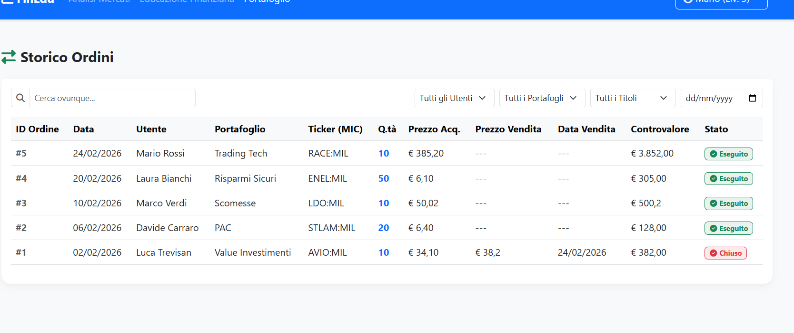

Ogni riga della pagina di gestione degli ordini è consentita la sola visualizzazione che viene filtrata secondo vari campi. Più precisamente: a destra, la barra di ricerca; dropdown per Utente, titolo acquistato, portafoglio, data. L'ordinamento della tabella viene, anch'essa, svolta tramite pulsanti degli elementi dell'intestazione. Se lo stato dell'ordine è “Chiuso” allora verranno stampate anche la data della chiusura, il prezzo a cui è stato venduto e il controvalore.

### 4.6 Società

#### Analisi di Mercato

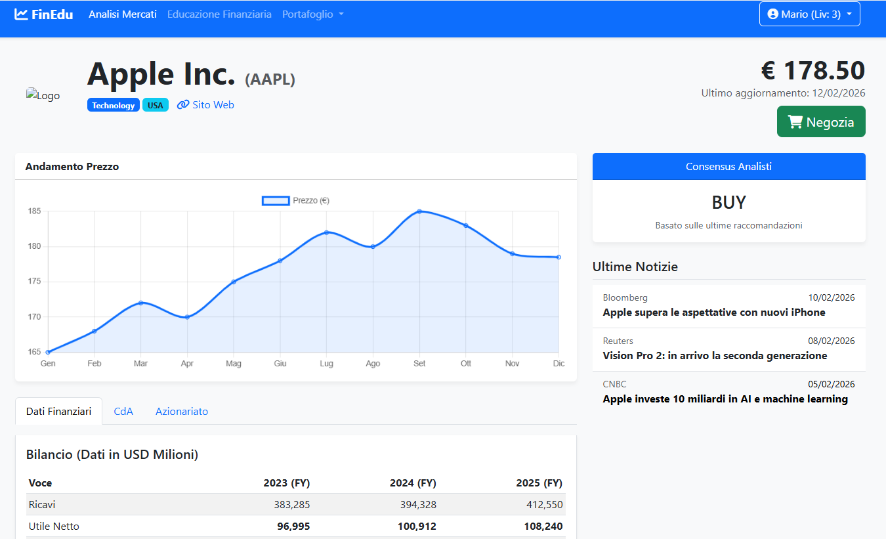

L'intestazione della pagina di ogni titolo comprende il nome della società, il ticker e la borsa valori. Come sottotitolo il settore, lo stato in cui ha la sede legale e il sito web. A destra, il prezzo corrente, la data dell'ultimo aggiornamento (aggiornate con chiamata AJAX ogni 15 minuti) e un bottone che apre un modal per negoziare il titolo.

Successivamente, viene mostrato il grafico degli ultimi 12 mesi con prezzo corrente come ultimo. Anche questi dati vengono recuperati con una richiesta asincrona. Per svilupparlo viene utilizzata la libreria Chart.js. Poi, sotto la parte destra dell'intestazione troviamo le ultime notizie riferite a quella società che se premute mostrano un pop-up con il corpo ed altre informazioni.

Alla fine della pagina si possono trovare i dati finanziari, il Consiglio di Amministrazione e l'azionariato che sono visualizzati uno alla volta grazie all'utilizzo di tabs o schede di Bootstrap.

#### Notizia

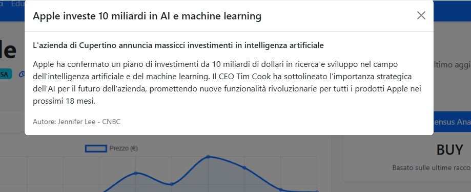

#### Negozia

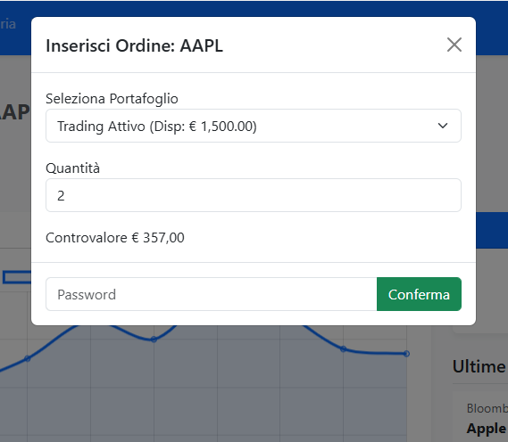

Nel modal aperto una volta premuto il bottone Negozia viene scelto il portafoglio in cui inserire l'ordine e la quantità. È, inoltre, mostrato il controvalore che cambia dinamicamente quando cambia la quantità. Per questioni di sicurezza prima di effettuare l'ordine è richiesta la password dell'utente. La gestione degli errori è real-time se la quantità è maggiore della disponibilità in quel portafoglio.

#### Gestione News

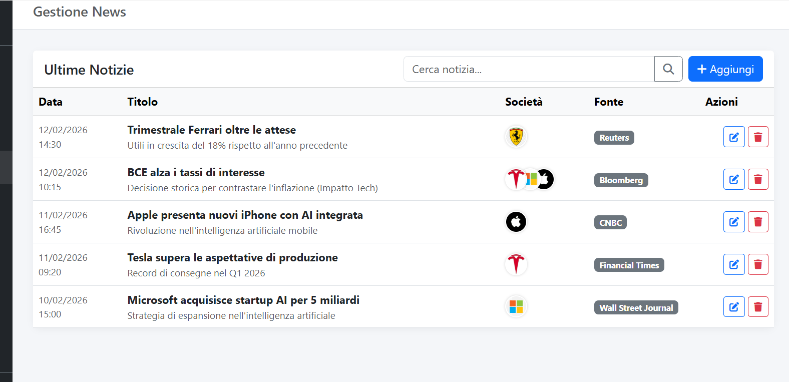

La pagina di gestione ha la stessa struttura delle altre pagine di visualizzazione lato amministrazione. La notizia, a differenza delle altre tabelle, è riferita a più compagnie(fino a 3) che vengono mostrate con il loro logo. Possono essere modificate, eliminate, visualizzate (click sulla riga) o aggiunte tramite form pop-up. È, poi, presente una caselle per cercare le notizie.

#### Form Pubblicazione Notizia

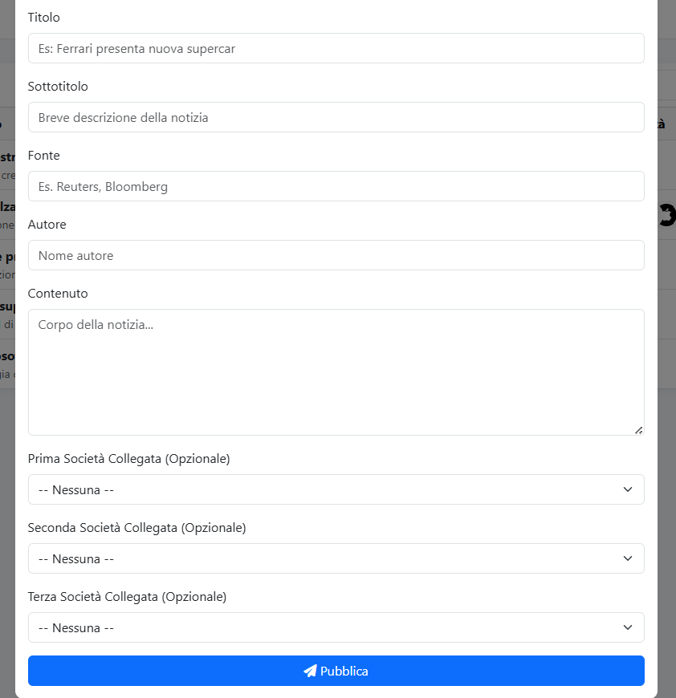

Nel modulo per pubblicare una notizia sono presenti una serie di input che permettono la creazione della stessa, si possono selezionare fino a 3 società collegate. Per quanto riguarda la modifica, il form risulta essere identico solo con i campi già riempiti.

#### Gestione Società

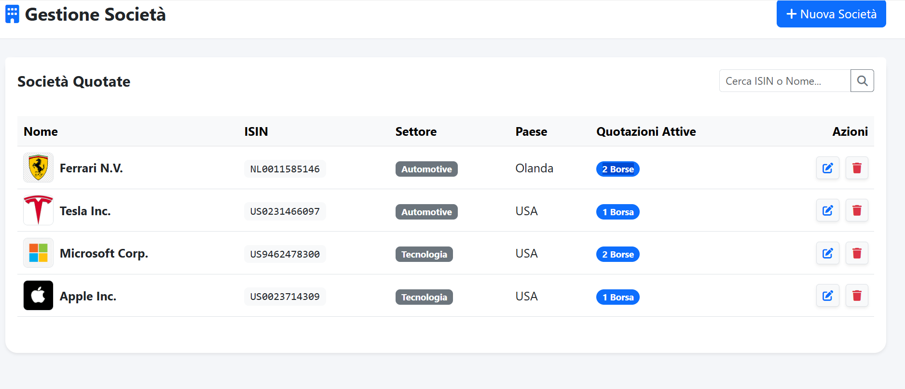

Anche la view per la gestione delle società è formata da una tabella con i dati principali, il numero di borse valori in cui è quotata, la possibilità di aggiungere, modificare, eliminare e filtrare la visualizzazione.

#### Aggiungi Società

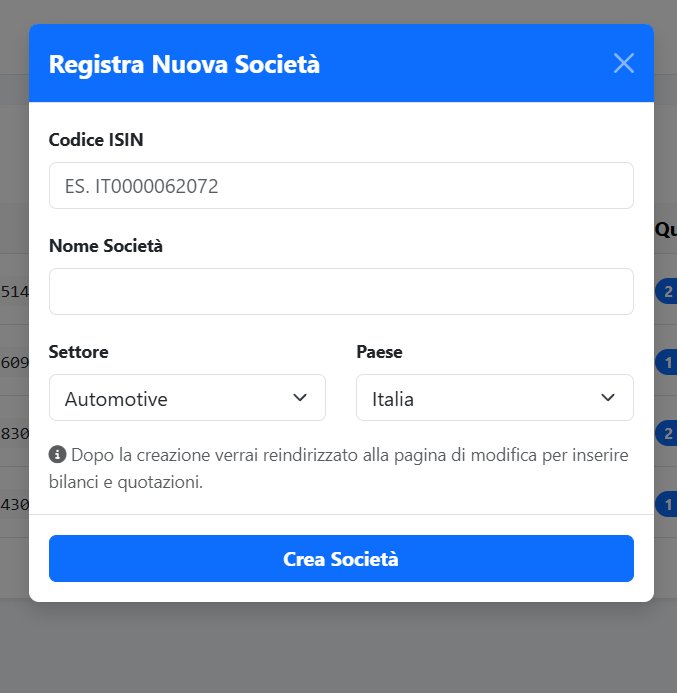

Come per le sezioni precedenti, l'aggiunta è resa possibile da un pop-up che richiede l'ISIN, il nome, il settore, il paese, eventualmente il logo e una volta confermata si ha la possibilità di aggiungere altre informazioni nella view di visualizzazione e modifica.

#### Modifica e/o Visualizzazione

Una volta confermata l'aggiunta o premuto il bottone modifica, i dati vengono possono essere visualizzati e modificati nella stessa view che presenta una struttura composta da quattro schede:

##### 1. Dati Base

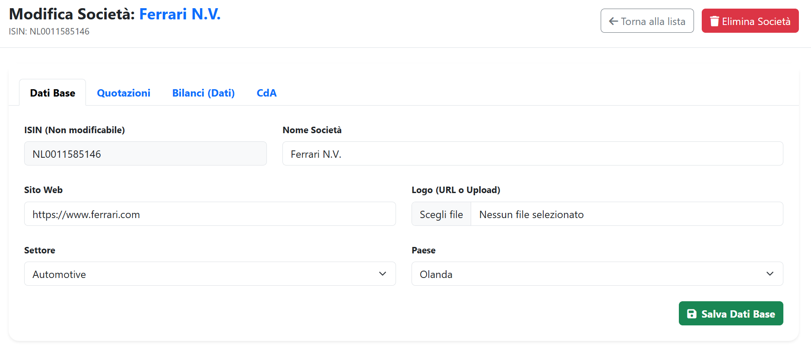

In cui viene mostrato l'ISIN (senza possibilità di modifica), il nome, il sito web, il settore, il paese ed un eventuale logo.

##### 2. Quotazioni

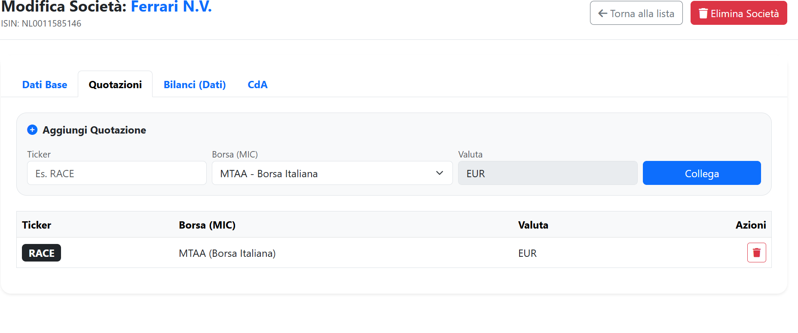

Con ogni quotazione della società selezionata e la possibilità di aggiungerne altre inserendo il ticker, la borsa che è una lista predefinita e la valuta che è riferita alla borsa è quindi è mostrata senza possibilità di modifica.

Sotto, vengono visualizzati con la possibilità di eliminarli.

##### 3. Bilanci (Dati Finanziari)

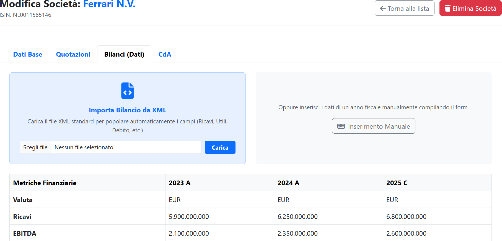

Dove sono presenti i dati finanziari inseriti e la possibilità di aggiungerne di nuovi tramite file XML standardizzato o manualmente.

##### 4. Consiglio di Amministrazione

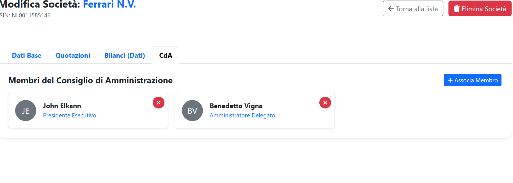

Nell'ultima scheda ci sono i membri del CdA, il loro ruolo ed una foto, se presente. Oltre a ciò c'è la possibilità di aggiungere o togliere un membro.

#### Gestione Borse Valori

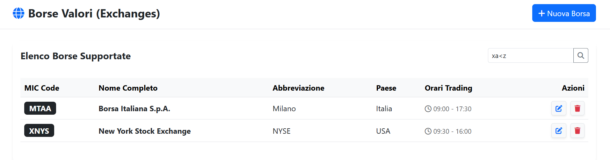

Esattamente come nelle altre tabelle di gestione, anche per le borse valori è presente una tabella con possibilità di modifica, aggiunta ed eliminazione.

### 4.7 Educazione Finanziaria

#### Moduli e Progressi

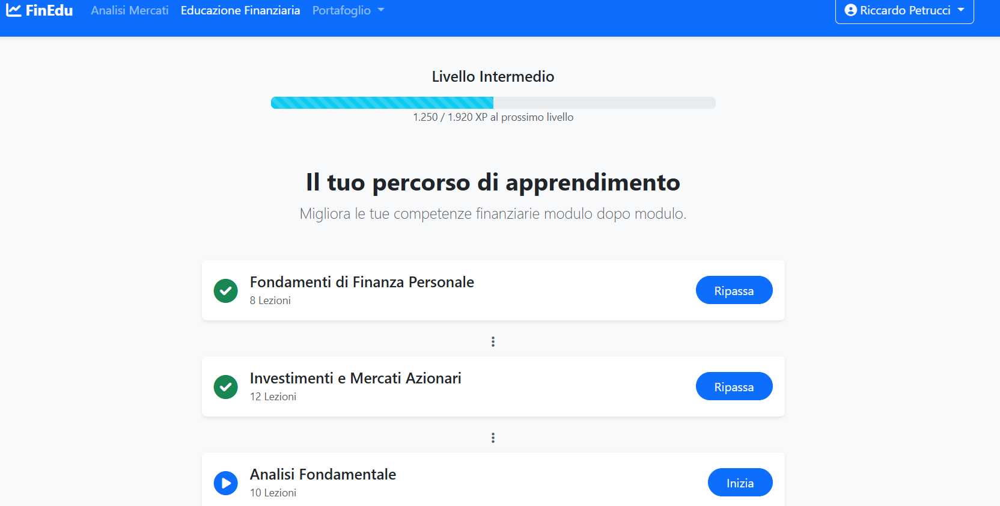

La pagina principale della sezione Educazione Finanziaria presenta i progressi con un progress Bootstrap con il livello e l'esperienza. Successivamente vengono mostrati il titolo, la descrizione e tutte le card con i moduli, che se completato può essere ripassato, se in corso può essere svolto e negli altri casi sono bloccati.

#### Modulo, Quiz

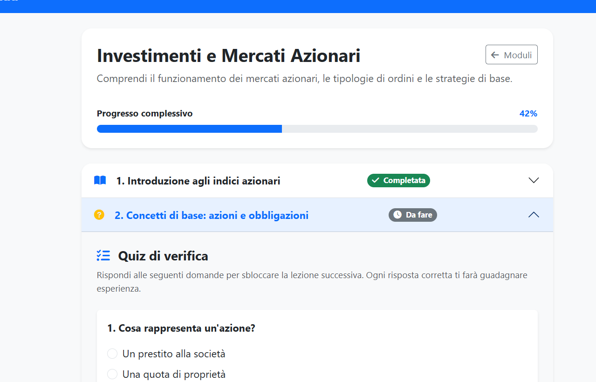

Anche la pagina del modulo ha un progress, non basato sull'esperienza ma sulle lezioni completate (in relazione alle lezioni totali di quel modulo). Al di sotto, si possono trovare degli elementi a fisarmonica (accordition Bootstrap) che possono essere aperti uno per volta. Questi contengono una spiegazione oppure un quiz, un radio input con 4 opzioni. La gestione dell'errore avviene in modo dinamico, una volta inviata la risposta, il bottone selezionato diventa rosso e viene mostrata una piccola spiegazione. A quel punto, l'utente può decidere di ritentare.

#### Modulo, Spiegazione

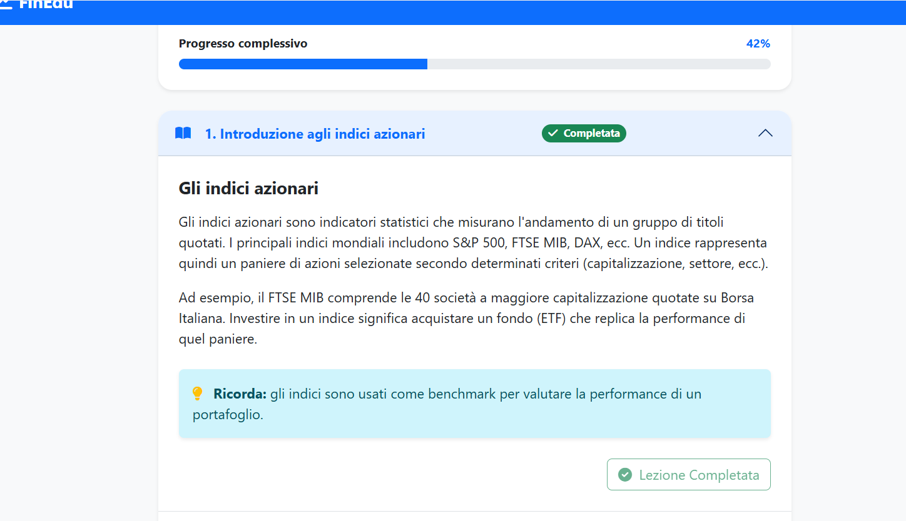

Quando l'elemento selezionato è una spiegazione, appare il titolo, il corpo e un suggerimento. Se completata viene mostrato un badge.

#### Gestione Moduli e Lezioni.

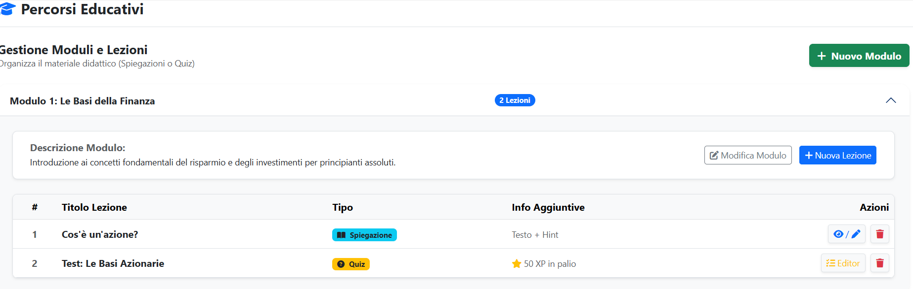

La pagina di gestione dei moduli ha un menù a fisarmonica per i moduli e dentro ognuno sono presenti le varie lezioni (quiz o spiegazioni). Ci sono le possibilità per aggiungere moduli, modificarli, aggiungere una lezione, visualizzarla, modificarla ed eliminarla. Le funzionalità riferite alla manipolazione del modulo sono strutturate nello stesso modo delle altre (pop-up). Per quanto riguarda la modifica dei quiz, è stata creata una view a parte.

#### Visualizza Spiegazione

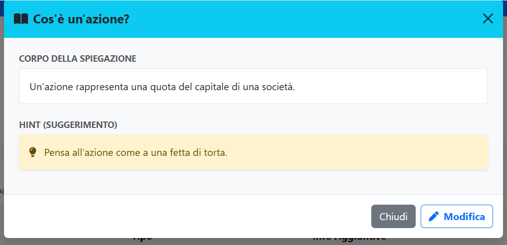

#### Modifica Spiegazione

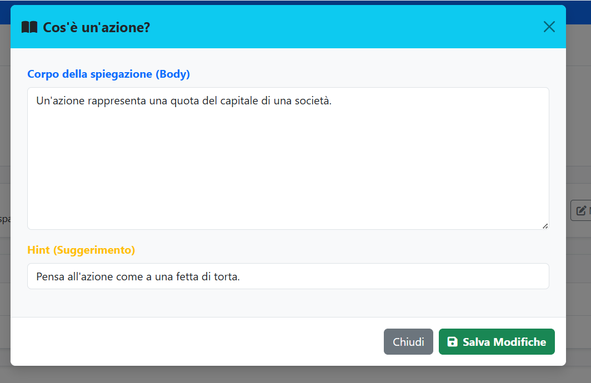

Una volta premuto il bottone per modificare i paragrafi vengono trasformati in textarea in cui è possibile modificare i campi.

#### Quiz Editor

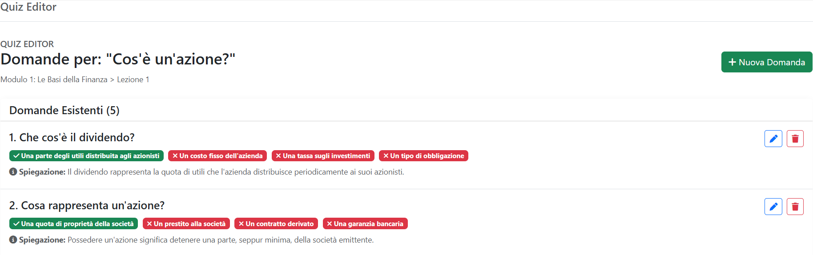

La view per la gestione dei quiz presenta la lista dei quiz con le 4 risposte (3 rosse errate e 1 verde corretta), la domanda e la spiegazione. Come in ogni pagina di gestione si possono svolgere le azioni CRUD.

#### Aggiungi e Modifica Quiz

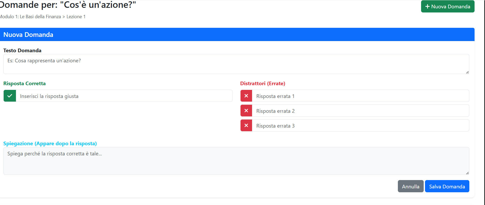

Il bottone aggiungi apre una sezione (collapse Bootstrap) che permette di inserire le risposte, la domanda e la spiegazione. Se invece si preme il pulsante modifica i campi vuoti vengono riempiti con le informazioni relative alla quiz scelto.

### 4.8 Tabelle Dizionario

Per ogni tabella dizionario (Roles, Newspapers, ecc. ) sono state sviluppate delle interfacce per CRUD. L’eliminazione non è possibile se è presente una chiave esterna su un’altra tabella.
